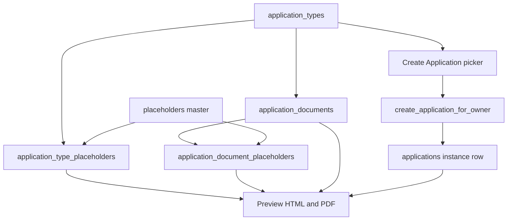

# DB-driven create application catalog

## Goal

Today a new letter/type requires edits in [`app/create-application/page.tsx`](app/create-application/page.tsx) (`permissionLibrary`, `departmentPermissionMap`), plus hardcoded maps in [`app/templates/applicationPreview.ts`](app/templates/applicationPreview.ts), [`app/api/application-preview-html/route.ts`](app/api/application-preview-html/route.ts) (`TEMPLATE_PATH_MAP`), and [`app/utils/applicantAppointmentPermissions.ts`](app/utils/applicantAppointmentPermissions.ts).

After this, adding a row in the catalog (and uploading HTML to Storage) is enough to:

1. Show the type on Create Application
2. Insert an `applications` row
3. Render preview from catalog `html` + placeholders
4. Know who signs from catalog `sign`



Live `applications` stays an instance table (`project_id` + `permission_type`). No new columns per letter.

## Schema (spreadsheet grain)

Follow the sheet you sketched. **Documents** are the indented lines (html / sign). **Placeholders are a shared master** — ward, proposal no, CTS, client name are defined once and linked to many applications/documents. They do not belong to one HTML file.

**`application_types`** — one creatable card (Application Type)

- `id` text PK, **lowercase snake_case** (`appointment_letter_for_architect`, `iod`)
- `department` text (`General`, `Building Permission`)
- `application_title` text unique — stored as `applications.permission_type` (instance column name unchanged so existing rows keep working)
- `description` text
- `category` text (`appointment_letter` | `department_permission`)
- `applicant_type` text null — roster match for General filter and consultant signer
- `token_suffix` text null, lowercase snake_case (`architect`, `ls`, `fire_safety`) — picks which applicant fills shared tokens like `{{CONSULTANT_NAME}}`, not a new token per letter
- `planning_authorities` text[] default `{}` — empty = all authorities; TDR variants use `{bmc}` / `{sra}`
- `requires_roster_match` boolean — General appointment letters
- `show_building_permission_fields` boolean — replaces `selectedDepartment === "Building Permission"`
- `is_active`, `sort_order`, `icon_key` (default `document`)

**`application_documents`** — Category / Sub Category / html / sign

- `id` text PK, lowercase snake_case (`architect_appointment`, `architect_acceptance`)
- `application_type_id` FK, same snake_case as `application_types.id`
- `category` text (e.g. `Appointment`, `Acceptance`, or `Application for IOD/CC pending concession by Architect/LS`)
- `sub_category` text null
- `html` text — Storage path in `Application_Templates` (`architect.html`, `architect_acceptance.html`)
- `sign` text[] — `{owner}`, `{owner,consultant}`, `{architect_or_ls}`
- `letter_variant` text null — `appointment` | `acceptance` (drives existing dual-letter UI)
- `sort_order`

**`placeholders`** — master field list (one row per token, reused)

Token format for **new** HTML is Mustache-style `{{WARD}}`. **Existing** letters that already use `$project_Ward.` stay as they are — do not convert those files.

- `id` text PK (`ward`, `proposal_number`, `survey_nos`, `consultant_name`)
- `token` text unique — `{{WARD}}`, `{{PROPOSAL_NUMBER}}`, `{{CONSULTANT_NAME}}`
- `legacy_token` text null — existing `$project_Ward.` (or `$project_Name_Architect`, etc.) so current Storage/repo HTML still fills
- `label` text
- `source_table` text (`projects`, `applicants`, `building_proposal_offices`, `computed`)
- `source_column` text (`project_info->>proposalNo`, `save_plot_details->>ward`)
- `ui_group` text (`subject`, `reference`, `consultant`, `client`, `office`, `letterhead`, `other`)
- `is_active`

Shared consultant fields stay one token (`{{CONSULTANT_NAME}}`, `{{REG_NO}}`). The application type’s `applicant_type` / `token_suffix` chooses *which person* fills them. Do not create `{{NAME_ARCHITECT}}` vs `{{NAME_LS}}`.

**`application_type_placeholders`** — shared fields for every document of that type (Key Variables + letter header)

- `application_type_id` + `placeholder_id` PK
- `required`, `sort_order`

**`application_document_placeholders`** — extra fields used only by that HTML (not a second definition of ward/proposal no)

- `document_id` + `placeholder_id` PK
- `required`, `sort_order`

Resolved placeholders for a document = **type links UNION document links**. Same `placeholders` row can be linked to Architect, Plumber, IOD, etc.

**View** `application_catalog_sheet` — Excel shape: Department, Application Type, Category, Sub Category, html, sign, placeholder, column, table. Shared placeholders repeat across rows; the source row is still one master record.

RLS: `SELECT` for `authenticated`, same pattern as [`supabase/migrations/20260521120000_create_building_proposal_offices.sql`](supabase/migrations/20260521120000_create_building_proposal_offices.sql). Writes stay in migrations / SQL editor.

## Seed

- All current cards from `permissionLibrary` + `departmentPermissionMap` in [`app/create-application/page.tsx`](app/create-application/page.tsx)
- General appointment letters: `applicant_type`, `token_suffix`, `requires_roster_match = true`, documents for appointment + acceptance HTML from `TEMPLATE_PATH_MAP` / `ACCEPTANCE_TEMPLATE_PATH_MAP`
- Insert shared placeholders **once** as `{{WARD}}`, `{{PROPOSAL_NUMBER}}`, `{{SURVEY_NOS}}`, `{{CLIENT_NAME}}`, `{{LETTER_DATE}}`, office block. Link them to every appointment type via `application_type_placeholders`. Set `legacy_token` to the current `$project_*` name
- **Do not rewrite** existing `architect.html` / `licensed-surveyor.html` (and other current Storage HTML). Those keep `$project_*`
- Catalog `id` / `token_suffix` are snake_case; existing `$project_Name_Architect` tokens in old HTML stay. Keep the current `$` field map in [`app/templates/applicationPreview.ts`](app/templates/applicationPreview.ts) for those files. New HTML uses `{{CONSULTANT_NAME}}` only
- Consultant tokens as one master row each: `{{CONSULTANT_NAME}}`, `{{CONSULTANT_FIRM}}`, `{{CONSULTANT_ADDRESS_LINE1}}`, `{{REG_NO}}`, `{{VALIDITY}}` — filled from the appointed applicant for that type
- Document-only links only for tokens unique to that HTML (e.g. `{{EEBP_PINCODE}}` on Architect acceptance)
- Building Permission `iod` as one type; add the four IOD/CC document rows you listed (html/sign can be empty until templates exist). IOD reuses the same project placeholders (ward, CTS, proposal no) — do not duplicate them
- TDR types: `planning_authorities` so BMC/SRA lists stay correct without `authorityPermissions`

## Create Application page

Replace in-file `permissionLibrary` / `departmentPermissionMap` / `departments` with a fetch of `application_types` (new helper e.g. [`app/utils/applicationCatalog.ts`](app/utils/applicationCatalog.ts)).

- Department dropdown = distinct `department` from active types (filtered by authority if `planning_authorities` is set)
- Application dropdown = types for that department
- Keep General roster filter, but drive it from `requires_roster_match` + `applicant_type` instead of [`APPLICANT_TYPE_TO_APPOINTMENT_PERMISSION_ID`](app/utils/applicantAppointmentPermissions.ts)
- Key Variables table: placeholders linked on the **application type** (shared master rows), not the hardcoded 9 fields and not document-only tokens
- Extra Building Permission inputs: `show_building_permission_fields` flag
- Create still calls `createApplicationForOwner` with `application_title` as the permission type string (same RPC arg as today)

## Create RPC

Update [`create_application_for_owner`](supabase/migrations/20260518190000_create_application_for_owner.sql) to reject unknown / inactive `application_title` (lookup `application_types`). Duplicate check unchanged (`23505`).

## Preview and signing (so a new DB row actually renders)

Existing `$project_*` HTML **stays**. New templates use `{{WARD}}`. Preview replaces both.

Change lookup order:

1. Load catalog row by matching `applications.permission_type` to `application_types.application_title`
2. Resolve HTML from `application_documents.html` + `letter_variant` instead of `TEMPLATE_PATH_MAP` in [`app/api/application-preview-html/route.ts`](app/api/application-preview-html/route.ts)
3. `token_suffix` in catalog is snake_case (`architect`, `ls`). Existing `$` filler keys (`project_Name_Architect`) stay for old HTML
4. Filler: catalog values replace `{{WARD}}`. If the HTML still contains `$project_*`, also apply the existing mapping (and `legacy_token`). New types with only `{{ }}` HTML use catalog only
5. `replaceTemplateTokens` handles `{{[A-Z0-9_]+}}` and existing `$project_*`. Strip leftover `{{...}}` and leftover `$project_*`. QR: existing `$project_Saved_Pdf_QR` stays in old HTML; new HTML may use `{{SAVED_PDF_QR}}`
6. Signers: document `sign` array + `applicant_type` for new types; keep current architect/consultant signing behavior for existing dual letters

[`app/userdashboard/documents/page.tsx`](app/userdashboard/documents/page.tsx) create path uses the same catalog titles / template key.

## What you do to add a new application (no code)

```sql
INSERT INTO application_types (id, department, application_title, category, applicant_type, token_suffix, requires_roster_match)
VALUES ('appointment_letter_for_parking_consultant', 'General', 'Appointment Letter for Parking Consultant',
        'appointment_letter', 'Parking Consultant', 'parking_consultant', true);

INSERT INTO application_documents (id, application_type_id, category, html, sign, letter_variant)
VALUES ('parking_consultant_appointment', 'appointment_letter_for_parking_consultant', 'Appointment',
        'parking-consultant.html', ARRAY['owner'], 'appointment');

-- reuse existing master placeholders ({{WARD}}, {{PROPOSAL_NUMBER}}, {{CONSULTANT_NAME}}, …)
INSERT INTO application_type_placeholders (application_type_id, placeholder_id, sort_order)
SELECT 'appointment_letter_for_parking_consultant', placeholder_id, sort_order
FROM application_type_placeholders
WHERE application_type_id = 'appointment_letter_for_architect';
```

HTML for **new** applications uses `{{WARD}}`, `{{PROPOSAL_NUMBER}}` — no `$`. Existing Architect/LS (and other current) HTML keeps `$project_*`. Do **not** insert another `placeholders` row for ward/proposal no. Only insert a master placeholder when the token itself is new.

Upload `parking-consultant.html` to bucket `Application_Templates`. Create Application shows it; create inserts; preview fills `{{WARD}}` from catalog bindings.

## Out of scope

- Admin UI for editing the catalog (SQL / Table Editor is the writer)
- Rewriting existing appointment HTML from `$project_*` to `{{WARD}}` — leave those files as they are
- Redesigning Architect/LS page layout or DSC stamp geometry
